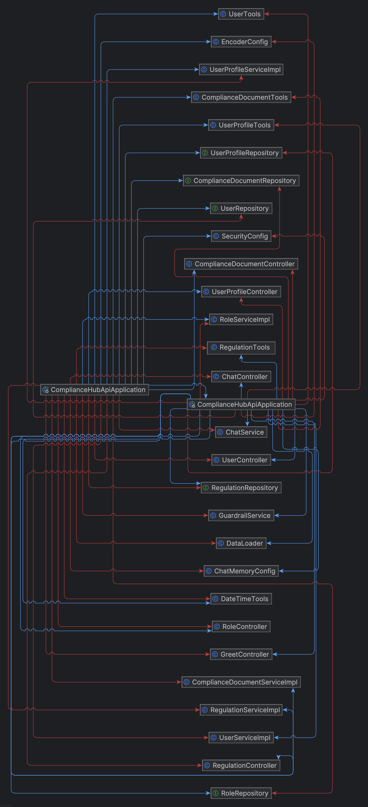

<!-- TOC -->
  * [Description of the project](#description-of-the-project)
  * [Class Diagram](#class-diagram)
  * [Setup](#setup)
    * [Prerequisites](#prerequisites)
  * [Technologies used](#technologies-used)
  * [Controllers and Route structures](#controllers-and-route-structures)
    * [Authentication:](#authentication)
    * [User:](#user)
    * [UserProfile:](#userprofile)
    * [Role:](#role)
    * [Regulation:](#regulation)
    * [ComplianceDocument:](#compliancedocument)
    * [AI Chat:](#ai-chat)
    * [Greet:](#greet)
    * [Any other requests: authenticated users](#any-other-requests-authenticated-users)
  * [Extra links](#extra-links)
  * [Future work](#future-work)
  * [Resources](#resources)
  * [Team Members](#team-members)
<!-- TOC -->

## Description of the project
ComplianceHub API is a RESTful backend application built with Spring Boot, designed to streamline compliance document management for marketplace sellers operating across European markets.

The platform allows sellers to submit and track compliance documents required by each marketplace's local regulations, while internal agents review submissions and regulation managers maintain the regulatory framework per country.

The system supports four roles — Seller, Agent, Regulation Manager, and Admin — each with their own scoped permissions enforced through stateless JWT-based authentication and Spring Security.

An integrated AI chat feature powered by Spring AI and OpenAI allows users to interact with the platform through natural language, with access to real-time tools such as date/time lookup and user data retrieval.

## Class Diagram

## Setup
#### Prerequisites
- Java 25+
- Maven 3.8+
- MySQL 8+
- An OpenAI API key (for the Spring AI chat feature)

1. Clone the repository
2. Configure the Database
3. Set the application properties
4. Configure the OpenAI API key
5. Run the application

## Technologies used
- Java
- Spring Boot
- Spring Web
- Spring Data JPA
- Spring Security (JWT-based authentication)
- Spring Validation
- Spring Boot DevTools
- Spring AI
- MySQL Database
- Maven
- Lombok

## Controllers and Route structures
### Authentication:
| Function | Method | **Endpoint** | Access |
|----------|--------|--------------|--------|
| Login    | POST   | /api/login   | Public |

### User:
| Function                      | Method | **Endpoint**                                    | Access         |
|-------------------------------|--------|-------------------------------------------------|----------------|
| Get all users                 | GET    | /api/users                                      | Agent          |
| Create a new user             | POST   | /api/users                                      | Public         |
| Get user by compliance status | GET    | /api/users/compliance-status/{complianceStatus} | Agent          |
| Get user by id                | GET    | /api/users/{id}                                 | Seller + Agent |
| Update user by id             | PUT    | /api/users/{id}                                 | Seller + Agent |
| Delete user by id             | DELETE | /api/users/{id}                                 | Admin          |

### UserProfile:
| Function                    | Method | **Endpoint**                       | Access         |
|-----------------------------|--------|------------------------------------|----------------|
| Get all user profiles       | GET    | /api/user-profile                  | Agent          |
| Create a new user profile   | POST   | /api/user-profile                  | Public         |
| Get user profile by user id | GET    | /api/user-profile/by-user/{userId} | Seller + Agent |
| Get user profile by  id     | GET    | /api/user-profile/{id}             | Seller + Agent |
| Update user profile by id   | PUT    | /api/user-profile/{userId}         | Seller         |

### Role:
| Function                   | Method | **Endpoint**               | Access |
|----------------------------|--------|----------------------------|--------|
| Create new role            | POST   | /api/roles                 | Admin  |
| Add role to user           | POST   | /api/roles/add-to-user     | Admin  |
| Delete a role by role name | DELETE | /api/roles/delete/roleName | Admin  |

### Regulation:
| Function                       | Method | **Endpoint**                              | Access                     |
|--------------------------------|--------|-------------------------------------------|----------------------------|
| Get all regulations            | GET    | /api/regulation                           | Agent + Regulation Manager |
| Create a new regulation        | POST   | /api/regulation                           | Regulation Manager         |
| Get regulations by marketplace | GET    | /api/regulation/marketplace/{marketplace} | Regulation Manager         |
| Get regulation by id           | GET    | /api/regulation/{id}                      | Regulation Manager         |
| Update regulation by id        | PUT    | /api/regulation/{id}                      | Regulation Manager         |
| Delete regulation by id        | DELETE | /api/regulation/{id}                      | Admin + Regulation Manager |

### ComplianceDocument:
| Function                                   | Method | **Endpoint**                                      | Access        |
|--------------------------------------------|--------|---------------------------------------------------|---------------|
| Get all compliance documents               | GET    | /api/compliance-document                          | Agent         |
| Create a new compliance document           | POST   | /api/compliance-document                          | Seller        |
| Get compliance document by document status | GET    | /api/compliance-document/document-status/{status} | Agent         |
| Get compliance document by document type   | GET    | /api/compliance-document/document-type/{type}     | Agent         |
| Get compliance document by user id         | GET    | /api/compliance-document/user/{userId}            | Agent         |
| Get compliance document by id              | GET    | /api/compliance-document/{id}                     | Agent         |
| Updae compliance document by id            | PUT    | /api/compliance-document/{id}                     | Agent         |
| Delete compliance document by id           | DELETE | /api/compliance-document/{id}                     | Agent + Admin |

### AI Chat:
| Function                           | Method | **Endpoint**                               | Access              |
|------------------------------------|--------|--------------------------------------------|---------------------|
| Get greeting                       | GET    | /orion/hello                               | Public              |
| Get an AI conversation with memory | POST   | /orion/compliance_copilot/{conversationId} | Authenticated users |

### Greet:
| Function              | Method | **Endpoint**        | Access              |
|-----------------------|--------|---------------------|---------------------|
| Get greeting          | GET    | /api/greet          |  Public             |
| Get personal greeting | GET    | /api/greet/personal | Authenticated users |

### Any other requests: authenticated users

## Extra links
- Project Management Board:
https://trello.com/invite/b/6a117d920f331643e15e992a/ATTIc50f4bad75791aed6092ce5c068f62342F0A984D/proyecto-final-backend

- Presentation Slides: https://prezi.com/view/WaeB6wnzuKaIRQCH1N2y

## Future work
1. **Global exception handler** — add a global exception handler; structured error responses across all endpoints instead of relying on default Spring error pages.
2. **Automatic compliance status recalculation** — when an Agent reviews a compliance document, the owning seller's complianceStatus should be recalculated automatically based on the status of all their documents, rather than being set manually.
3. **Document expiry and renewal** — add expiry dates to compliance documents and automatically flag or downgrade sellers whose documents have outdated.
4. **Role-scoped AI chatbot** — extend the chatbot so that its available tools and the data it can access are scoped to the authenticated user's role (e.g. agents see all users, sellers see only themselves).
5. **Frontend client** — build a web or mobile interface that consumes the API, providing a visual compliance dashboard for sellers and a document review queue for agents.

## Resources

## Team Members
1. Developer: Selim Helvacı
2. Mentor: Salvatore Corsaro

